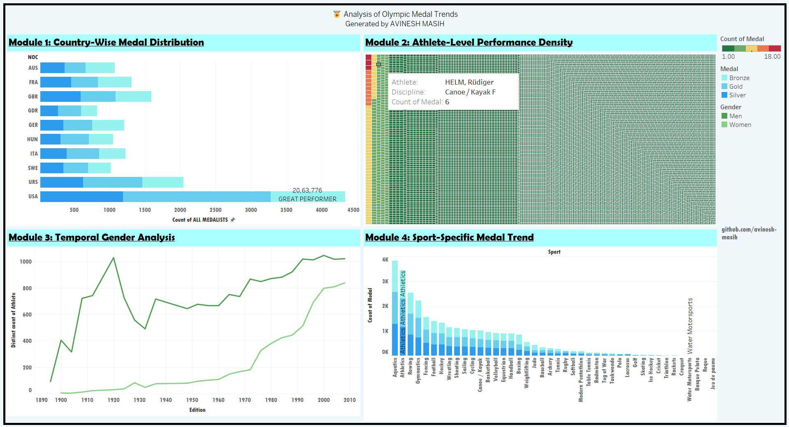

# 🏅 Olympic Medal Trends Analysis – Tableau Dashboard Project

This repository contains the **Olympic Medal Trends Analysis** project developed using **Tableau**, conducted for **AthletiCore Analytics** in collaboration with the **International Olympic Committee (IOC)**. The goal is to explore over a century of Olympic data (1896–2008) and uncover trends in country dominance, athlete performance, gender representation, and sport-specific medal distributions.

---

## 🏢 About the Company – AthletiCore Analytics

**AthletiCore Analytics** is a premier data consultancy firm specializing in **performance analytics** and **strategic sports intelligence**. Partnering with global Olympic bodies and sports federations, the firm provides advanced data visualization, forecasting, and policy-focused recommendations to shape the future of sports equity, funding, and talent scouting.

As a data analyst at AthletiCore, your mission is to go beyond dashboards—crafting data stories that shape international policy and investments in sport.

---

## 📌 Problem Statement

The **IOC** has commissioned a longitudinal study of Summer Olympic medal data from **1896 to 2008**. The objective is to:

- Analyze country-wise medal trends over time
- Track gender participation evolution
- Identify dominant athletes and recurring medalists
- Evaluate medal density by sport
- Derive policy insights for future Olympic planning

---

## 📊 Tableau Dashboard Modules

### 📍 Module 1: Country-Wise Medal Distribution
- **Visualization**: Bar Chart / Map  
- **Metrics**: NOC (Country Code), COUNT(Medal)  
- **Goal**: Rank top 10 countries by total medal count  
- **Insight**: USA and Russia dominate historically, with rising contributions from China post-1990.

---

### 🧑‍🤝‍🧑 Module 2: Athlete-Level Performance Density
- **Visualization**: Treemap / Table  
- **Metrics**: Athlete, COUNT(Medal)  
- **Goal**: Identify multi-medal winners and dominance across editions  
- **Insight**: Athletes like Michael Phelps, Larisa Latynina, and Usain Bolt showcase consistent excellence.

---

### ⚥ Module 3: Temporal Gender Analysis
- **Visualization**: Dual-line Chart  
- **Metrics**: Edition, COUNT(Athlete), Gender  
- **Goal**: Track the evolution of male vs. female participation  
- **Insight**: Female representation was minimal until the 1980s; major increases after 1992 due to equity reforms.

---

### 🏅 Module 4: Sport-Specific Medal Trends
- **Visualization**: Stacked Bar Chart  
- **Metrics**: Sport, COUNT(Medal), Medal Type  
- **Goal**: Identify high-medal-density sports  
- **Insight**: Athletics, Aquatics, and Gymnastics dominate medal distributions.

---

## 🔧 Data Preparation & Modeling

- Imported Excel dataset into Tableau
- Cleaned and standardized formatting
- Handled missing values and nulls
- Converted categorical fields where necessary

### 🧮 Calculated Field: Performance Category
A custom field to assign medals into performance tiers beyond just Gold, Silver, and Bronze—used for ranking excellence.

---

## 📌 Key Analytical Findings

### 🌍 Country Performance
- USA leads in cumulative medal count  
- China, Australia saw rapid growth post-1980s

### 🏃‍♂️ Athlete Excellence
- Some athletes medaled in 2–4 Olympic editions  
- High specialization in single-discipline dominance

### 👩 Gender Dynamics
- Olympics were male-dominated until late 20th century  
- Dramatic rise in women’s participation post-1992

### 🏋️‍♂️ Sport Dominance
- Athletics, Aquatics, and Gymnastics are top medal earners  
- Niche sports like Fencing show high density per event

---

## 🧭 Strategic Recommendations

### 📈 Investment Strategy
- Prioritize training in high-yield sports (e.g., Track & Field, Swimming)
- Use cost-per-medal metrics for better ROI

### ⚖️ Gender Equity Roadmap
- Enforce minimum gender participation quotas
- Promote and fund women's events worldwide

### 🧠 Talent Identification Models
- Use repeat-performer patterns to build early-stage scouting pipelines

### 📊 Monitor Sporting Evolution
- Track new Olympic sports to assess their impact on traditional medal trends

---

## 📁 Dataset Information

- **Dataset**: Olympic_Medals_Dataset (Excel)  
- **Years Covered**: 1896–2008  
- **Key Columns**:  
  - `City`: Host city  
  - `Edition`: Year of Olympics  
  - `Sport` / `Discipline`  
  - `Athlete`  
  - `Gender`, `Event`, `Event_gender`  
  - `Medal`: Gold / Silver / Bronze  
  - `NOC`: 3-letter country code

---

## 🛠 Tools & Technologies

- **Tableau Desktop**  
- **Excel** as the data source  
- Calculated Fields, Filters, and Interactive Dashboards

---

## 📷 Dashboard Screenshot

> This dashboard showcases historical Olympic medal trends, revealing insights into country-wise dominance, top-performing athletes, gender participation shifts, and sport-specific medal distributions—empowering strategic planning and policy decisions in sports development.

---

## 📝 How to Use

1. Open the Tableau workbook (`.twb` or `.twbx`) in Tableau Desktop.
2. Review individual worksheets corresponding to each analysis task.
3. Navigate to the Dashboard for a consolidated view.
4. Use filters to explore data based on city, seller type, and property status.

---
## License

This project is protected under a custom license. Unauthorized use, modification, distribution, or reproduction of the code and any associated materials is strictly prohibited without explicit written permission from the author.

By accessing this repository, you agree to adhere to the following conditions:

* You may view, study, and contribute only with prior approval from the repository owner.  
* You may not copy, redistribute, or use any part of this repository for personal, academic, or commercial purposes without authorization.

## Disclaimer 

This code is provided as is, without warranty of any kind, express or implied, including but not limited to the warranties of merchantability or fitness for a particular purpose. The author shall not be held liable for any damages or consequences resulting from the use or misuse of this repository.

## Contact

For inquiries or permissions or contribute to this project, please reach out via:

        
