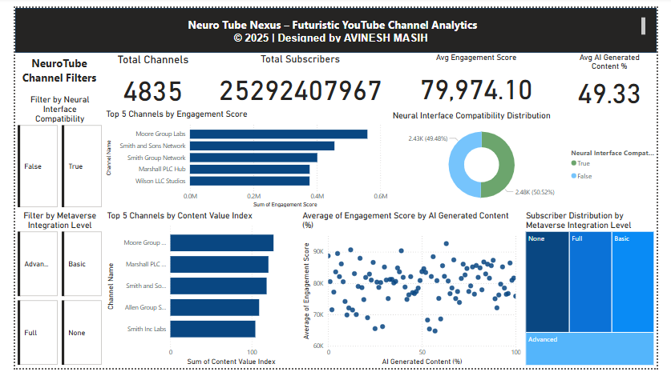

# 🧠 Organisation NeuroTube Nexus - Futuristic Media Channel Analysis Dashboard (Power BI)

This repository contains an interactive Power BI dashboard designed for **Organisation NeuroTube Nexus**, a futuristic digital platform analyzing YouTube-like channel metrics involving AI-generated content, metaverse integration, and neural interface compatibility. The objective was to evaluate content performance, audience engagement, and technological integration trends across media channels in the year 2025.

---

## 📌 Project Objective

To build a comprehensive and insightful Power BI dashboard that uncovers:

- 📊 Channel-wise Engagement Score & Content Value Index  
- 🤖 AI-generated content influence  
- 🧬 Neural Interface Compatibility  
- 🌐 Metaverse Integration Levels  
- 👥 Subscriber Distribution  
- 🔍 Advanced filtering and segmentation capabilities  

This dashboard empowers decision-makers to identify high-performing futuristic media channels and understand technology adoption trends.

---

## 📷 Dashboard Snapshot

> The dashboard combines KPIs, bar charts, treemaps, donut charts, and slicers to present actionable insights across multiple futuristic attributes.

---

## 💡 Key Features

- 🔢 **KPI Cards**:
  - Total Channels  
  - Total Subscribers  
  - Avg. Engagement Score  
  - Avg. % of AI-Generated Content  

- 📊 **Bar Charts**:
  - **Top 5 Channels by Engagement Score**  
  - **Top 5 Channels by Content Value Index**

- 🍩 **Donut Chart**:
  - Neural Interface Compatibility (True/False distribution)

- 🧱 **Treemap**:
  - Metaverse Integration Levels (None, Partial, Advanced, Full) vs Subscriber Counts

- 🎛️ **Interactive Slicers**:
  - Neural Interface Compatibility  
  - Metaverse Integration Level  

- 🛠️ **Custom Tooltips**:
  - Hover to view additional insights like Avg Video Length, Total Videos, and Subscribers.

---

## 🛠️ Tools & Technologies

- Power BI Desktop  
- DAX (Data Analysis Expressions)  
- Power Query for preprocessing  
- Custom filtering (Top N filters, slicers)  
- Visual types: Card, Bar, Treemap, Donut, KPI, Tooltip configuration  

---

## 🧮 Aggregations & Logic

- **Engagement Score**: Average for KPIs, used as-is in visuals  
- **Content Value Index**: Average or direct column values (no aggregation for Top 5)  
- **Subscriber Count**: Aggregated as Sum for treemap and cards  
- **AI Content %**: Average for summary card  
- **Filters**: Top N filters applied on Channel Name with values like Engagement Score / Content Value Index  

---
## License

This project is protected under a custom license. Unauthorized use, modification, distribution, or reproduction of the code and any associated materials is strictly prohibited without explicit written permission from the author.

By accessing this repository, you agree to adhere to the following conditions:

* You may view, study, and contribute only with prior approval from the repository owner.  
* You may not copy, redistribute, or use any part of this repository for personal, academic, or commercial purposes without authorization.

## Disclaimer 

This code is provided as is, without warranty of any kind, express or implied, including but not limited to the warranties of merchantability or fitness for a particular purpose. The author shall not be held liable for any damages or consequences resulting from the use or misuse of this repository.

## Contact

For inquiries or permissions or contribute to this project, please reach out via:

        