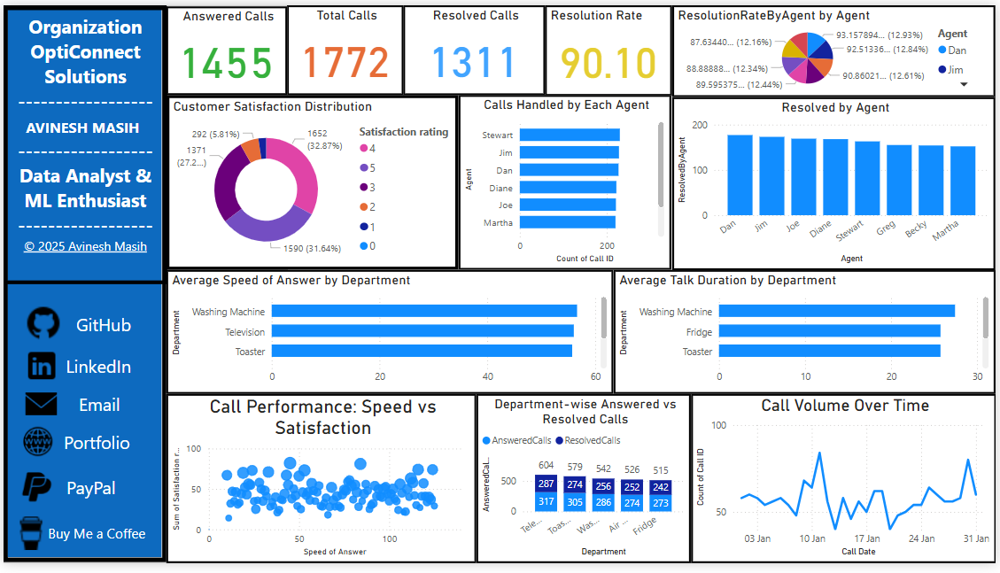

# 📊 OptiConnect Solutions - Call Center Performance Analysis (Power BI Dashboard)

This repository contains a Power BI dashboard Assignment developed to analyze and optimize call center performance for **OptiConnect Solutions**. As a data analyst, I leveraged Power BI to uncover actionable insights from call center operations data, focusing on improving speed of answer, resolution rates, customer satisfaction, and agent efficiency.

## Assignment Overview

OptiConnect Solutions, a reputed call center service provider, needed to enhance its customer experience by analyzing operational metrics such as:

- **Call Volume Over Time**
- **Speed of Answer**
- **Resolution Rates**
- **Average Talk Duration**
- **Customer Satisfaction Trends**
- **Agent Performance**

Using Power BI, this assignment visualizes key metrics, identifies hidden trends, and supports data-driven decision-making through an interactive dashboard.

## Screenshots
Here’s a snapshot of the interactive dashboard created for the **OptiConnect Solutions Call Center Performance Analysis** Assignment:

> This dashboard visualizes key metrics like Call Volume Trends, Speed of Answer vs. Satisfaction, Resolution Rates, and Agent Performance, providing actionable insights for decision-makers.

## Features

- 📈 **Line Chart** showing call volumes over time  
- 📊 **Scatter Plot** exploring the relationship between answer speed and satisfaction  
- 🎯 **KPI Cards** for average call duration, resolution rates, and satisfaction score  
- 📅 **Date Filtering** for dynamic time-based analysis  
- 📌 **Agent-wise Insights** to highlight top performers and improvement areas  
- 🧠 **Professional Branding Sidebar** with embedded personal contact and portfolio links

## Tools & Technologies

- Power BI Desktop  
- DAX for calculated columns and measures  
- Power Query for data cleaning and transformation

## License

This project is protected under a custom license. Unauthorized use, modification, distribution, or reproduction of the code and any associated materials is strictly prohibited without explicit written permission from the author.

By accessing this repository, you agree to adhere to the following conditions:

* You may view, study, and contribute only with prior approval from the repository owner.  
* You may not copy, redistribute, or use any part of this repository for personal, academic, or commercial purposes without authorization.

## Disclaimer 

This code is provided as is, without warranty of any kind, express or implied, including but not limited to the warranties of merchantability or fitness for a particular purpose. The author shall not be held liable for any damages or consequences resulting from the use or misuse of this repository.

## Contact

For inquiries or permissions or contribute to this project, please reach out via:

        
