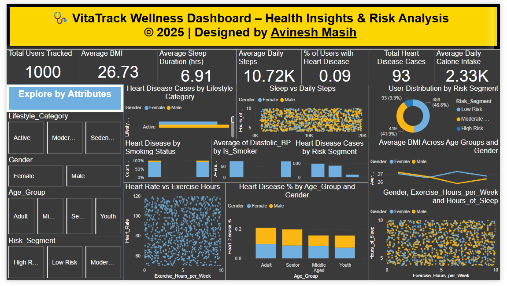

# 🩺 VitaTrack Wellness - Health & Activity Dashboard (Power BI Assignment)

This repository contains a Power BI dashboard assignment developed for **VitaTrack Wellness** to explore and visualize health and activity data. As a data analyst, I utilized Power BI to gain actionable insights into lifestyle patterns, risk factors, and health outcomes such as heart disease prevalence, physical activity, and sleep habits.

---

## 📌 Assignment Overview

**VitaTrack Wellness**, a health analytics initiative, aims to improve well-being by analyzing individual health metrics and behaviors. The dashboard provides interactive visualizations to assist in:

- 🚶‍♂️ **Daily Steps & Sleep Patterns**
- ❤️ **Heart Disease Prevalence**
- 🚭 **Smoking vs Heart Risk Analysis**
- 🧠 **Lifestyle Risk Segmentation**
- 🏋️ **Exercise vs Heart Rate**
- 📊 **BMI, Blood Pressure, and Calories Trends**

This project enables a better understanding of health data to support wellness decisions.

---

## 📷 Dashboard Screenshot

> The dashboard highlights lifestyle categories, heart health trends, and wellness indicators like BMI, steps, and sleep—allowing stakeholders to identify risk patterns and target interventions.

---

## 🔍 Features

- 🔢 **KPI Cards** for BMI, Blood Pressure, Steps, Sleep, Heart Disease %, etc.  
- 📈 **Scatter Plots** for:
  - Sleep vs Daily Steps  
  - Sleep vs Exercise Hours  
  - Heart Rate vs Exercise Hours  
- 📊 **100% Stacked Column** for Smoking vs Heart Disease  
- 🔀 **Interactive Slicers** for:
  - Age Group
  - Gender
  - Lifestyle Category
  - Is Smoker
  - Has Heart Disease
  - Risk Segment
- 🧮 **DAX Measures** for heart disease %, average steps, average sleep, and more  
- 🎨 **Clean Layout** with slicer section and modern visuals

---

## 🛠️ Tools & Technologies

- Power BI Desktop  
- Power Query for data cleaning  
- DAX (Data Analysis Expressions) for custom calculations  
- Scatter, column, card, and KPI visualizations

---
## License

This project is protected under a custom license. Unauthorized use, modification, distribution, or reproduction of the code and any associated materials is strictly prohibited without explicit written permission from the author.

By accessing this repository, you agree to adhere to the following conditions:

* You may view, study, and contribute only with prior approval from the repository owner.  
* You may not copy, redistribute, or use any part of this repository for personal, academic, or commercial purposes without authorization.

## Disclaimer 

This code is provided as is, without warranty of any kind, express or implied, including but not limited to the warranties of merchantability or fitness for a particular purpose. The author shall not be held liable for any damages or consequences resulting from the use or misuse of this repository.

## Contact

For inquiries or permissions or contribute to this project, please reach out via:

        