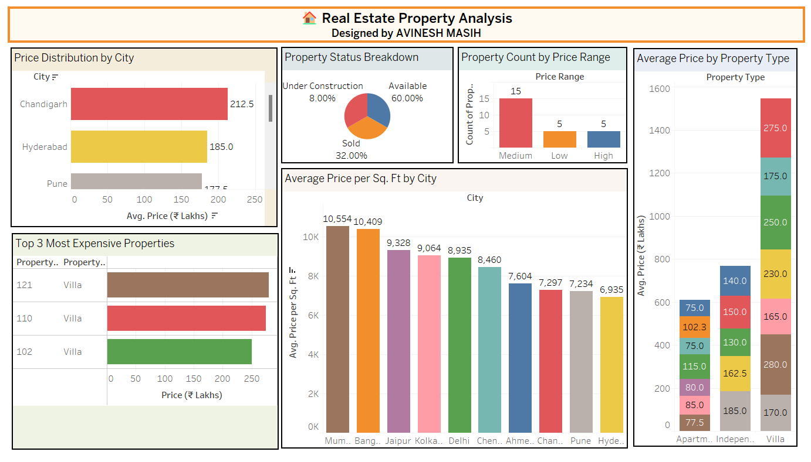

# 🏠 Real Estate Property Analysis – Tableau Assignment

This repository contains the **Real Estate Property Analysis** project developed using **Tableau**, aimed at exploring market trends, pricing patterns, property types, and seller insights across various cities in India.

The goal is to visualize property distribution, price ranges, and seller status with interactive dashboards and derive actionable insights for decision-makers or real estate analysts.

---

## 📌 Assignment Overview

The analysis includes the following key tasks:

- **Task 1: City-Wise Property Price Distribution**  
  Horizontal bar chart showing how property prices vary across different cities.

- **Task 2: Average Price by Property Type**  
  Stacked bar chart visualizing average prices of Apartments, Villas, and Independent Houses.

- **Task 3: Top 3 Most Expensive Properties**  
  Table or bar chart showcasing the highest-priced listings.

- **Task 4: Property Status Distribution**  
  Pie chart showing the percentage of properties that are Sold, Available, or Under Construction.

- **Task 5: Price per Sq. Ft. by City**  
  Bar chart calculating the average price per square foot across cities.

- **Task 6: Property Count by Price Range (Low, Medium, High)**  
  Categorized bar chart to analyze how properties are distributed across price segments.

---

## 📊 Visualizations Included

- Horizontal & Vertical Bar Charts  
- Stacked Bar Chart  
- Pie Chart  
- Table with Conditional Formatting  
- Calculated Fields and Grouping  
- Filters & Highlight Actions

---

## 📷 Dashboard Screenshot

> This dashboard provides key insights into the real estate market, highlighting property price trends, city comparisons, and seller status—enabling better understanding and targeting of buyer segments.

---

## 🛠 Tools & Technologies

- **Tableau Desktop** for creating visualizations  
- **Excel/CSV** as the data source  
- Basic **Table Calculations** (e.g., Percent of Total)  
- Calculated Fields & Groups for price segmentation  
- Interactive Filters and Highlights

---

## 📝 How to Use

1. Open the Tableau workbook (`.twb` or `.twbx`) in Tableau Desktop.
2. Review individual worksheets corresponding to each analysis task.
3. Navigate to the Dashboard for a consolidated view.
4. Use filters to explore data based on city, seller type, and property status.

---
## License

This project is protected under a custom license. Unauthorized use, modification, distribution, or reproduction of the code and any associated materials is strictly prohibited without explicit written permission from the author.

By accessing this repository, you agree to adhere to the following conditions:

* You may view, study, and contribute only with prior approval from the repository owner.  
* You may not copy, redistribute, or use any part of this repository for personal, academic, or commercial purposes without authorization.

## Disclaimer 

This code is provided as is, without warranty of any kind, express or implied, including but not limited to the warranties of merchantability or fitness for a particular purpose. The author shall not be held liable for any damages or consequences resulting from the use or misuse of this repository.

## Contact

For inquiries or permissions or contribute to this project, please reach out via:

        
