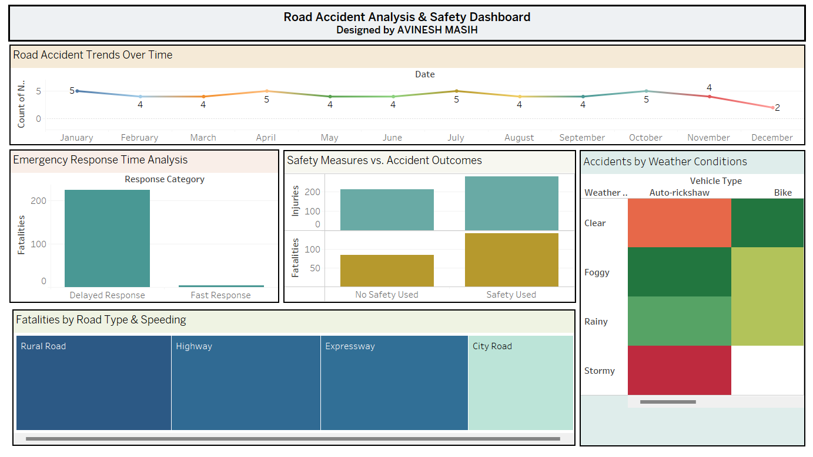

# 🚨 Road Accident Analysis - Tableau Assignment 3

This repository contains the **Road Accident Analysis** project developed using **Tableau** to explore patterns, causes, safety measures, and emergency response trends associated with road accidents.

The objective is to derive **actionable insights** and **visual storytelling** from road accident data using interactive dashboards and visualizations to support policy-making and safety enhancements.

---

## 📌 Assignment Overview

The analysis includes the following major tasks:

- **Task 1: Handling Missing Values**  
  Replacing N/A values in the “Helmet Used” column with "Unknown" to ensure data completeness.

- **Task 2: Road Accident Trends Over Time**  
  Analyzing how accident occurrences have changed over time using line charts.

- **Task 3: Impact of Weather Conditions on Accidents**  
  Heatmap visualization to study the effect of various weather conditions on accident frequencies.

- **Task 4: Compare Accidents with and without Safety Measures**  
  Comparing fatality and injury rates based on seat belt and helmet usage.

- **Task 5: Fatality Rates by Road Type and Speeding**  
  Using a Tree Map to visualize fatality rates by road type and analyze speeding as a factor.

- **Task 6: Emergency Response Time Analysis (Using Parameters)**  
  Parameterized threshold to classify emergency responses into "Fast" or "Delayed" and analyze fatalities using bar charts.

- **Task 7: Road Accident Story**  
  A complete Tableau Story presenting key findings, insights, and recommendations for decision-makers.

---

## 📊 Visualizations Included

- Line Charts  
- Bar Charts (Grouped and Stacked)  
- Heatmaps  
- Tree Maps  
- Calculated Fields & Parameters  
- Dashboard Story Points

---

## 📷 Dashboard Screenshot

> This dashboard provides an interactive overview of accident trends, safety insights, weather impacts, emergency response times, and high-risk factors—enabling stakeholders to take data-driven actions for reducing road accidents.

---

## 🛠 Tools & Technologies

- **Tableau Desktop**  
- **Excel / CSV** as data source  
- Calculated Fields, Parameters, and Filters  
- Interactive Dashboards and Stories

---

## 📝 How to Use

1. Open the Tableau Workbook (`.twb` or `.twbx`) using Tableau Desktop.
2. Explore each worksheet representing individual tasks.
3. Use filters and parameters to interact with visualizations.
4. Navigate through the Dashboard and Story to view combined insights.

---
## License

This project is protected under a custom license. Unauthorized use, modification, distribution, or reproduction of the code and any associated materials is strictly prohibited without explicit written permission from the author.

By accessing this repository, you agree to adhere to the following conditions:

* You may view, study, and contribute only with prior approval from the repository owner.  
* You may not copy, redistribute, or use any part of this repository for personal, academic, or commercial purposes without authorization.

## Disclaimer 

This code is provided as is, without warranty of any kind, express or implied, including but not limited to the warranties of merchantability or fitness for a particular purpose. The author shall not be held liable for any damages or consequences resulting from the use or misuse of this repository.

## Contact

For inquiries or permissions or contribute to this project, please reach out via:

        
