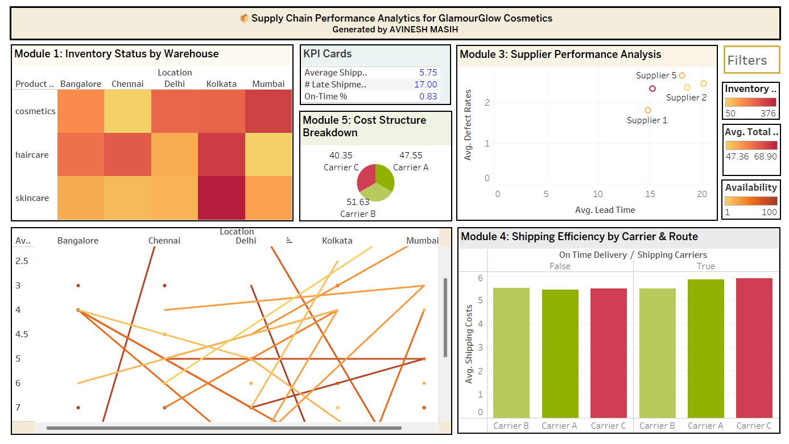

# 📦 Supply Chain Performance Analytics for GlamourGlow Cosmetics - Tableau Dashboard Project 2

This repository contains the **Supply Chain Performance Analytics** project for **GlamourGlow Cosmetics**, developed using **Tableau**. The objective is to deliver a comprehensive, real-time analytics dashboard that enables strategic insights, operational awareness, and cost optimization across the company’s supply chain.

---

## 🏢 About the Company

**GlamourGlow Cosmetics** is a rapidly growing beauty brand operating via a hybrid B2C and B2B model. The company manages a global supplier base, multiple warehouses, and high seasonal demand variability. As GlamourGlow scales, inefficiencies such as inventory imbalance, supplier inconsistency, and siloed operations have surfaced.

---

## 📌 Problem Statement

Despite strong growth, GlamourGlow faces critical supply chain challenges:

- **Inventory Imbalance** – Overstocking and stockouts occur simultaneously due to poor inventory visibility.
- **Supplier Volatility** – Lead times and defect rates vary significantly across partners.
- **Fulfillment Lags** – Late deliveries are not effectively tracked.
- **Cost Escalation** – Rising freight and fuel charges impact profit margins.
- **Data Siloing** – Disconnected spreadsheets hinder decision-making.

The leadership team requires a centralized Tableau dashboard that reveals KPIs, highlights inefficiencies, and guides proactive planning.

---

## 🧩 Dataset Overview

The dataset covers all dimensions of the supply chain:

- **Inventory** – Stock levels, reorder points, safety stock, product IDs
- **Orders** – Order status, delivery times, fulfillment rates
- **Suppliers** – Lead time, defect rate, cost per unit
- **Logistics** – Shipping duration, carrier ID, delivery success
- **Costs** – Manufacturing, logistics, returns, overhead
- **Customer Info** – Region, demographics, purchase volume
- **Sales** – Units sold, revenue, sales channel

---

## 🎯 Project Objectives

Build an interactive Tableau dashboard delivering:

1. Inventory health across warehouses and SKUs
2. Order performance trends and delay hotspots
3. Supplier benchmarking by cost, lead time, and defects
4. Route efficiency and logistics cost breakdowns
5. End-to-end cost structure visibility

---

## 🪜 Step-by-Step Approach

### 🔹 Step 1: Data Preparation

- Clean and normalize date, ID, and metric fields
- Join tables using keys like Product ID, Supplier ID, Order ID
- Create calculated fields, e.g., On-Time Delivery %

### 🔹 Step 2: Dashboard Modules

#### 📦 Module 1: Inventory Status by Warehouse
- **Chart Type**: Heatmap / Bullet Chart
- **Goal**: Detect overstock and stockout patterns
- **Insight**: East Zone has frequent understocking

#### 📈 Module 2: Order Fulfillment & Delivery Trends
- **Chart Type**: Line Chart + KPI Cards
- **Goal**: Track order efficiency over time and by region
- **Insight**: Weekends and the West Region show recurring delays

#### 🧮 Module 3: Supplier Performance Analysis
- **Chart Type**: Scatter Plot / Table
- **Goal**: Compare suppliers on cost vs. reliability
- **Insight**: Supplier C is cheapest but has the highest defect rate

#### 🚛 Module 4: Shipping Efficiency by Carrier & Route
- **Chart Type**: Bar Chart / Map
- **Goal**: Identify top-performing logistics partners
- **Insight**: Carrier B on the southern route is most efficient

#### 💰 Module 5: Cost Structure Breakdown
- **Chart Type**: Pie Chart + Time Series
- **Goal**: Visualize major cost drivers
- **Insight**: Logistics costs spike during promotions; returns are rising in Q4

---

## 🔍 Strategic Insights & Business Recommendations

- 📦 **Rebalance Inventory**  
  Use demand-based predictive restocking and automate reorder points.

- 🧑‍🏭 **Supplier Rationalization**  
  Shift to reliable suppliers even at higher costs to reduce SLA breaches.

- 🚚 **Optimize Delivery**  
  Address failed deliveries using region/time-slot-based rerouting.

- 💹 **Track End-to-End Cost**  
  Implement alerts for cost surges in logistics or raw materials.

- 📊 **Centralize Operations Data**  
  Use Tableau integrated with ERP/WMS as a single source of truth.

---

## 🛠 Tools & Technologies

- **Tableau Desktop** – Interactive visualization
- **Excel/CSV** – Data input and transformation
- **Calculated Fields** – SLA tracking, cost breakdown, KPIs
- **Joins & Blends** – Relational analysis across tables

---

## 📷 Dashboard Screenshot

> This dashboard provides real-time insights into GlamourGlow’s supply chain, showcasing inventory status, supplier performance, order fulfillment trends, logistics efficiency, and cost breakdown—empowering data-driven decisions across the supply chain lifecycle.

---

## 📝 How to Use

1. Open the Tableau workbook (`.twb` or `.twbx`) in Tableau Desktop.
2. Review individual worksheets corresponding to each analysis task.
3. Navigate to the Dashboard for a consolidated view.
4. Use filters to explore data based on city, seller type, and property status.

---
## License

This project is protected under a custom license. Unauthorized use, modification, distribution, or reproduction of the code and any associated materials is strictly prohibited without explicit written permission from the author.

By accessing this repository, you agree to adhere to the following conditions:

* You may view, study, and contribute only with prior approval from the repository owner.  
* You may not copy, redistribute, or use any part of this repository for personal, academic, or commercial purposes without authorization.

## Disclaimer 

This code is provided as is, without warranty of any kind, express or implied, including but not limited to the warranties of merchantability or fitness for a particular purpose. The author shall not be held liable for any damages or consequences resulting from the use or misuse of this repository.

## Contact

For inquiries or permissions or contribute to this project, please reach out via:

        
