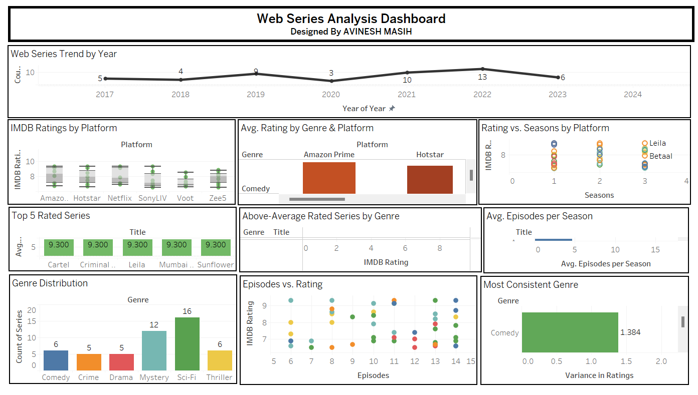

# 🎬 Web Series Analysis - Tableau Assignment

This repository contains the **Web Series Analysis** project developed using **Tableau** to explore trends, ratings, genres, and platform performances of various web series.

The objective is to provide interactive visualizations and insights into the growing web series industry by analyzing data such as release trends, IMDB ratings, genre distributions, and platform-specific performances.

---

## 📌 Assignment Overview

The analysis covers the following key aspects:

- **Trend of Web Series Released Per Year**  
  Visualizing the growth or decline in the number of web series released annually.

- **Distribution of IMDB Ratings Across Streaming Platforms**  
  Comparing viewer ratings across different platforms using box plots.

- **Top 5 Highest Rated Web Series**  
  Highlighting the top-rated shows with a horizontal bar chart.

- **Genre Distribution of Web Series**  
  Showing how web series are distributed across genres.

- **Relationship Between Number of Episodes and IMDB Rating**  
  Using scatter plots to examine if longer series have better ratings.

- **Platform-Wise Average IMDB Rating by Genre**  
  Analyzing which genres perform best on each streaming platform with heatmaps.

- **Episodes Per Season Analysis**  
  Comparing average episodes per season across web series.

- **IMDB Rating vs. Number of Seasons (Grouped by Platform)**  
  Investigating rating trends based on the number of seasons and platform.

- **Identifying the Most Consistent Genre in Ratings**  
  Determining genres with the lowest rating variance.

- **Highlighting Web Series with Above-Average Ratings in Each Genre**  
  Filtering shows that outperform their genre averages.

---

## 📊 Visualizations Included

- Line Charts  
- Box Plots  
- Horizontal and Vertical Bar Charts  
- Scatter Plots  
- Heatmaps  
- Tables with Conditional Formatting

---
## 📷 Dashboard Screenshot

> This dashboard visualizes key trends and insights in the web series industry, including release patterns, platform ratings, genre popularity, and episode dynamics—enabling stakeholders to understand audience preferences and platform performance at a glance.

---

## 🛠 Tools & Technologies

- **Tableau Desktop** for data visualization  
- **CSV/Excel** data sources  
- Basic **calculated fields** and **table calculations** in Tableau  
- Filters and interactive dashboards

---

## 📝 How to Use

1. Open the Tableau workbook (.twb or .twbx) file in Tableau Desktop.
2. Navigate through the individual worksheets corresponding to each task.
3. Use filters and highlights for interactive exploration.
4. Review the dashboard for combined insights.

---
## License

This project is protected under a custom license. Unauthorized use, modification, distribution, or reproduction of the code and any associated materials is strictly prohibited without explicit written permission from the author.

By accessing this repository, you agree to adhere to the following conditions:

* You may view, study, and contribute only with prior approval from the repository owner.  
* You may not copy, redistribute, or use any part of this repository for personal, academic, or commercial purposes without authorization.

## Disclaimer 

This code is provided as is, without warranty of any kind, express or implied, including but not limited to the warranties of merchantability or fitness for a particular purpose. The author shall not be held liable for any damages or consequences resulting from the use or misuse of this repository.

## Contact

For inquiries or permissions or contribute to this project, please reach out via:

        
